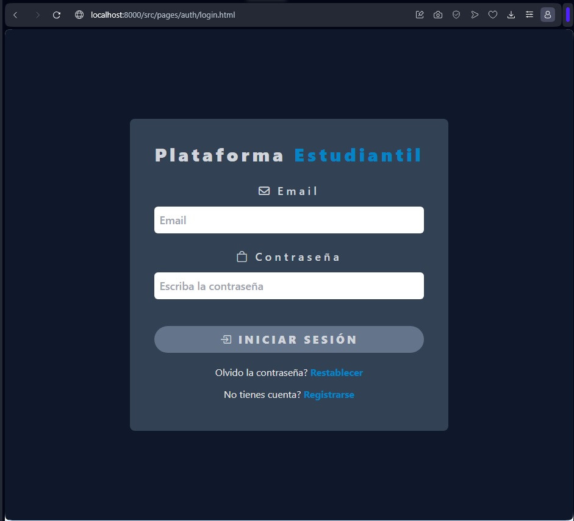

<h1 align='center'>Plataforma</h1>

El siguiente documento sería un mini tutorial de una proyecto que se esta desarrollando para aprobar el curso de fullstack 'primeros pasos' de **talentTech Bogotá**.


Este proyecto es la parte del FrontEnd, que se está realizando de la siguiente manera:


se esta utilizando para el desarrollo del proyecto lo siguiente:

- **Html** puro.
- los estilos con **Tailwind**.
- las peticiones se utilizará **axios**.
- para instalar los framework o librerias usamos **npm**.
- el funcionamiento con **JavaScript**.

Para manejar el front y el back de manera local se necesita lo siguiente:

- para creación de la base de datos se utilizará **MongoDB**.
- para poder usar los metodos del crud en el front toca instalar **Cors**
- Necesitamos instalar un servidor para poder ejecutar nuestro proyecto en front http-server

## Creación del proyecto

Para crear el proyecto se necesita hacer lo siguiente:

- Creamos una carpeta llamada **ColegiosFront** o como usted desee llamarlo.

- Primero que todo se necesita tener instalado node js, si no lo tiene 
    - se puede descargar desde el siguiente enlace: https://nodejs.org/es/download/

- Iniciamos npm
    - `$ npm init -y`

- Dentro de la carpeta creamos otra carpeta llamada **src**, en esa carpeta colocaremos todos los archivos estaticos, estilos y archivos js.

- Luego en la carpeta principal instalamos tailwind postcss y autopreficer.
    - `$ npm install -D tailwindcss postcss autoprefixer`

- Hacemos la respectiva configuración para que los estilos de tailwind funcionen:

    - `$ npx tailwindcss init`

    - Creamos un archivo **postcss.config.js** en la carpeta raiz con el siguiente contenido:

        - ```javascript
                module.exports = {
                    plugins: {
                        tailwindcss: {},
                        autoprefixer: {},
                    },
                }
           ```

    - Creamos una carpeta llamada **css** dentro de la carpeta **src**

        - dentro de esa carpeta creamos un archivo llamado **styles.css**

            - Añadimos las siguientes directivas de tailwind en ese archivo

                - `@tailwind base;
                    @tailwind components;
                    @tailwind utilities;`

    - Configuramos el archivo **tailwind.config.js** en nuestro proyecto

        - Dentro de ese archivo debemos configurar lo siguiente:

        - ```javascript
                module.exports = {
                    content: [
                        './src/pages/**/*.html',
                        './src/api/**/*.js',
                    ],
                    theme: {
                        extend: {},
                    },
                    plugins: [],
                }
          ```
        
        -Ojo en content se debe colocar la estructura de carpetas del proyecto para que los estilos de tailwind se puedan usar correctamente
    
    - Configuramos un script en el archivo **package.json** para compilar los archivos Css de tailwind.
        - ```javascript
                "scripts": {
                "build:css": "tailwindcss -i ./src/css/styles.css -o ./dist/output.css --watch"
                }`
          ```
    - Ahora en cada archivo html se debe colocar lo siguiente para que le funcione los estilos:
        - ```html
            <link rel="stylesheet" href="../../../dist/output.css">
          ```

    -Por ultimos debemos ejecutar el siguiente comando en la terminal:
        - `npm run build:css`

- Seguimos con la organización de las carpetas y archivos:

- En la carpeta **src**, creamos 5 carpetas, las llame de la siguiente manera; **api, css(que ya la habiamos creado anteriormente), img, js, pages**.

- En la carpeta **pages** que es donde vamos a manejar todos los archivos html, creamos 2 carpetas, las llame **admin y auth**.
    - En la carpeta **auth** creamos una carpeta llamada **entidades**
        - Dentro de **auth** creamos por el momento 4 archivos html que se llamaran de la siguiente manera; **login, registrarDocentes, registrarEstudiantes, registrarUsuarios**.

            - 

            - 
        
        - Nos dirigimos a la carpeta **entidades**, dentro de ella tenemos 2 archivos html por el momento, **registrarEntidades y actualizarEntidades**.
            
            - 

            - 

    - Ahora nos dirigimos a la carpeta **admin** donde tenemos por el momento un archivo.

            - 
    
    - Nos dirigimos a la carpeta api, en esa carpeta tenemos un archivo js, donde manejaremos todas las peticiones http para el crud entidades.

    


    - Para que nos funcione las peticiones del archivo **entidades.api.js**, de manera local, tenemos que hacer la siguiente configuración:

        - tenemos que crear en el front un servidor para poder ejecutarlo en otro puerto:

            - `npm install -g http-server 8000`

            - Luego de instalar el servidor, se inicia con un comando en la terminal

                - `http-server -p 8000`
            
            - Tenemos que tener tambien otra terminar para ejecutar el siguiente comando que nos sirve para los estilos:

                - `npm run build:css`


        - En la parte del back tenemos que hacer una modificación para que funcione la conexión:

            - Nos dirigimos a la carpeta raiz donde tenemos el back e instalamos lo siguiente

                - `npm install cors`

                - Luego nos dirigimos al archivo **app.js** y realizamos la configuración para que funcione cors.

                    - ```javascript
                        const cors = require('cors');

                        //se debe colocar antes del midelware y las rutas
                        app.use(cors({
                            origin: '*',
                            methods: ['GET', 'POST', 'PUT', 'DELETE'],
                            allowedHeaders: ['Content-Type', 'Authorization']
                        }));
                      ```
                
            - Tambien tenemos que tener otra terminar para inicializar el bak

                - `node app.js`

                - Ojo tenemos que tener la base de datos en mongodb.


 
           


                    


